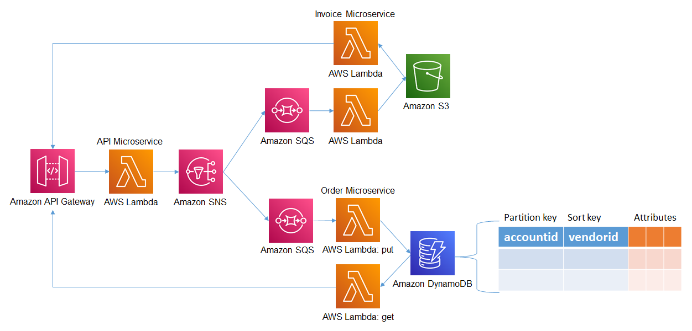

## Example
This is a basic CDK TypeScript example that deploys 3 AWS Lambda functions decoupled by Amazon SNS and Amazon SQS. The example also demonstates using Python to put items to Amazon DynamoDB, put object to Amazon S3 and using Amazon SNS message attributes. 



## Setup

1. The following prerequisities are required for this example
  
```bash
npm install -g typescript
npm install -g aws-cdk
```

2. Since this CDK project uses ['Assests'](https://docs.aws.amazon.com/cdk/latest/guide/assets.html), you might need to run the following command to provision resources the AWS CDK will need to perform the deployment.

```bash 
cdk bootstrap
```

2. Install the dependencies

```bash
npm install
```

3. Execute **cdk synth** to synthesize as AWS CloudFormation template

```bash
cdk synth
```

4. Execute **cdk deploy** to deploy the template and build the stack

```bash
cdk deploy
```

5. The API Gateway will be deployed by the stack and can be tested using the following json object.

```bash
{
  "order": {
    "orderid": "3",
    "coffeetype": "Flat white",
    "coffeesize": "Small",
    "vendorid": "1"
  }
}
```

6. You can also test using curl , make sure you replace `<api gateway>` with your gateway address and change the orderid in data.json for each execution. 

```bash
curl <api gateway>/order -d '@data.json' -H "Content-Type: application/json"
```