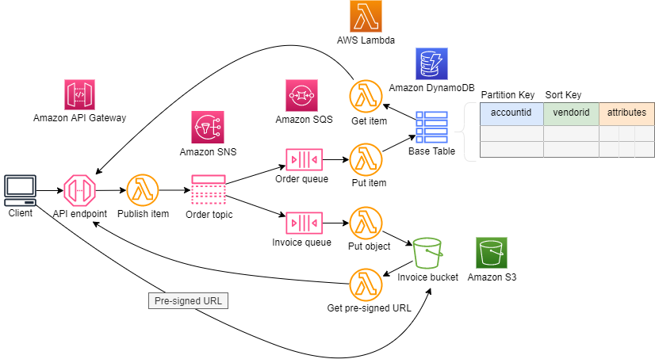

## Example
This example uses the AWS CDK to deploy an Amazon API Gateway, AWS Lambda functions, Amazon DynamoDB table, Amazon SQS queue, Amazon SNS topic and an Amazon S3 bucket. 

The deployed architecture decouples the Lambda functions from each other by using Amazon SQS and Amazon SNS. The Amazon API Gateway integrates with a Lambda function, which accepts an order that is posted by the client. The function extracts the body from the event and publishes it as a message to an Amazon SNS topic.

The SNS topic sends the published message to a couple of Amazon SQS queues, which are subscribers. The Lambda function associated with each queue is invoked when the message arrives in the queue.

The invoice Lambda function writes the message to an Amazon S3 bucket, this is saved as an object. 

The order Lambda function writes messages to an Amazon DynamoDB table, this is saved as an item. The Amazon DynamoDB table is partitioned on an accountid attribute and also includes a sort key on the vendorid attribute, together they form the primary key.

Additional Lambda functions are deployed to get the order item from Amazon DynamoDB and the object from the Amazon S3 bucket.




**Jupyter Notebook Scripts**

1. The first script posts new orders to the API Gateway. The order is written to an Amazon DyanmoDB table and invoice is written to an Amazon S3 bucket.

2. The second script creates a json formatter which is used to render the json output in a readable format.

3. The fourth script is used to query items in the Amazon DynamoDB table

4. The final script is used to generate a pre-signed url used to get the object from the S3 bucket.

## Setup

1. The following prerequisities are required for this example
  
```bash
npm install -g typescript
npm install -g aws-cdk
```
Install Jupyter Notebook following instructions on this ['site'](https://jupyter.org/install).

2. Since this CDK project uses ['Assests'](https://docs.aws.amazon.com/cdk/latest/guide/assets.html), you might need to run the following command to provision resources the AWS CDK will need to perform the deployment.

```bash 
cdk bootstrap
```

2. Install the dependencies

```bash
npm install
```

3. Execute **cdk synth** to synthesize as AWS CloudFormation template

```bash
cdk synth
```

4. Execute **cdk deploy** to deploy the template and build the stack

```bash
cdk deploy
```

1. Open the Jupyter Notebook in the **jupyter_notebook directory** follow the instructions.

2. Check the dynamoDB table and S3 bucket